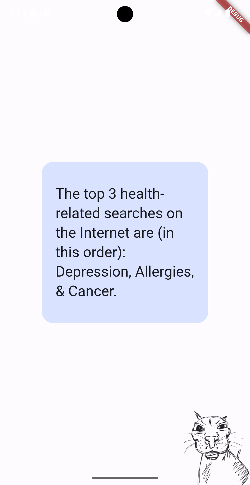
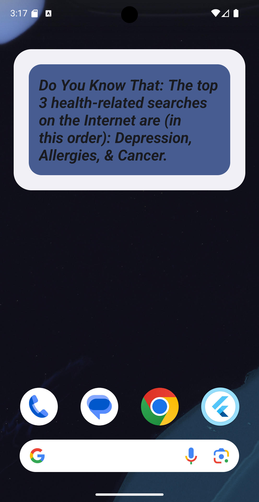

# Random Fact

The Random Fact Flutter app is a simple yet engaging application that fetches and displays random facts every 30 minutes. It also includes a home screen widget that updates with new facts, ensuring users always have quick access to interesting trivia. The app features a simple UI, so there's no need to open the app to see the latest fact.

## Features

- Fetches random facts from Useless Facts API every 30 minutes.

- Home screen widget that displays the latest random fact.

- Automatically updates widget content whenever a new fact is fetched.

- Simple UI design ensures usability without opening the app.

## Important Notes

Do not remove the app from the recently opened apps list in your operating system. The widget's periodic updates rely on the app remaining active in the background.

## Dependencies

home_widget: ^0.7.0: For creating and managing home screen widgets.

http: ^1.3.0: To make network requests and fetch random facts.

dynamic_color: ^1.7.0: To support dynamic theming based on system colors.

flutter_screenutil: ^5.9.3: For responsive UI design across devices.

shared_preferences: ^2.3.5: To store the latest fact locally for widget updates.

## API Reference

The app fetches random facts from the Useless Facts API:

Endpoint: https://uselessfacts.jsph.pl/api/v2/facts/random?language=en

Response: JSON object containing a random fact.

## Screenshots

  
  

